# 🧠 blue-assistant

🧠 `@assistant` runs [AI](https://github.com/kamangir/openai-commands) [DAG](https://networkx.org/)s that combine deterministic and AI operations.

```bash
pip install blue-assistant
```

```mermaid
graph LR
    assistant_script_list["@assistant<br>script<br>list"]
    assistant_script_run["@assistant<br>script<br>run -<br>script=&lt;name&gt;,version=&lt;version&gt;<br>&lt;object-name&gt;"]

    web_crawl["@web<br>crawl -<br>&lt;url-1&gt;+&lt;url-2&gt;<br>&lt;object-name&gt;"]

    web_fetch["@web<br>fetch -<br>&lt;url&gt;<br>&lt;object-name&gt;"]

    script["📜 script"]:::folder
    url["🔗 url"]:::folder
    url2["🔗 url"]:::folder
    url3["🔗 url"]:::folder
    object["📂 object"]:::folder


    script --> assistant_script_list

    script --> assistant_script_run
    object --> assistant_script_run
    assistant_script_run --> object

    url --> web_crawl
    url2 --> web_crawl
    web_crawl --> url3
    web_crawl --> object

    url --> web_fetch
    web_fetch --> object

    bridge_ip["🔗 bridge_ip"]:::folder
    hue_username["🔗 hue_username"]:::folder
    list_of_lights["💡 light IDs"]:::folder

    hue_create_user["@hue<br>create_user"]
    hue_list["@hue<br>list"]
    hue_set["@hue<br>set"]
    hue_test["@hue<br>test"]

    bridge_ip --> hue_create_user
    hue_create_user --> hue_username

    bridge_ip --> hue_list
    hue_username --> hue_list
    hue_list --> list_of_lights

    bridge_ip --> hue_set
    hue_username --> hue_set
    list_of_lights --> hue_set

    bridge_ip --> hue_test
    hue_username --> hue_test
    list_of_lights --> hue_test



    classDef folder fill:#999,stroke:#333,stroke-width:2px;
```



|   |   |   |
| --- | --- | --- |
| [`orbital-data-explorer`](./blue_assistant/script/repository/orbital_data_explorer) [](./blue_assistant/script/repository/orbital_data_explorer) Poking around [Orbital Data Explorer](https://ode.rsl.wustl.edu/) with an [AI DAG](./blue_assistant/script/repository/orbital_data_explorer/metadata.yaml). ⏸️ | [`@hue`](./blue_assistant/script/repository/hue) [](./blue_assistant/script/repository/hue) "[Hey AI](./blue_assistant/script/repository/hue/metadata.yaml), help me write code to send color commands to the [Hue LED lights](https://www.philips-hue.com/en-ca) in my apartment." | [`blue-amo`](./blue_assistant/script/repository/blue_amo/README.md) [](./blue_assistant/script/repository/blue_amo/README.md) Story development and visualization, with an [AI DAG](./blue_assistant/script/repository/blue_amo/metadata.yaml). |
| [`🌀 blue script`](./blue_assistant/script/) [](./blue_assistant/script/) A minimal AI DAG interface. | [``@RAG``](./blue_assistant/RAG/) [](./blue_assistant/RAG/)  RAG on a DAG. 🔥 | [``@web``](./blue_assistant/web/) [](./blue_assistant/web/) A minimal web interface for an AI agent. |

---


[](https://github.com/kamangir/blue-assistant/actions/workflows/pylint.yml) [](https://github.com/kamangir/blue-assistant/actions/workflows/pytest.yml) [](https://github.com/kamangir/blue-assistant/actions/workflows/bashtest.yml) [](https://pypi.org/project/blue-assistant/) [](https://pypistats.org/packages/blue-assistant)

built by 🌀 [`blue_options-4.240.1`](https://github.com/kamangir/awesome-bash-cli), based on 🧠 [`blue_assistant-4.399.1`](https://github.com/kamangir/blue-assistant).
