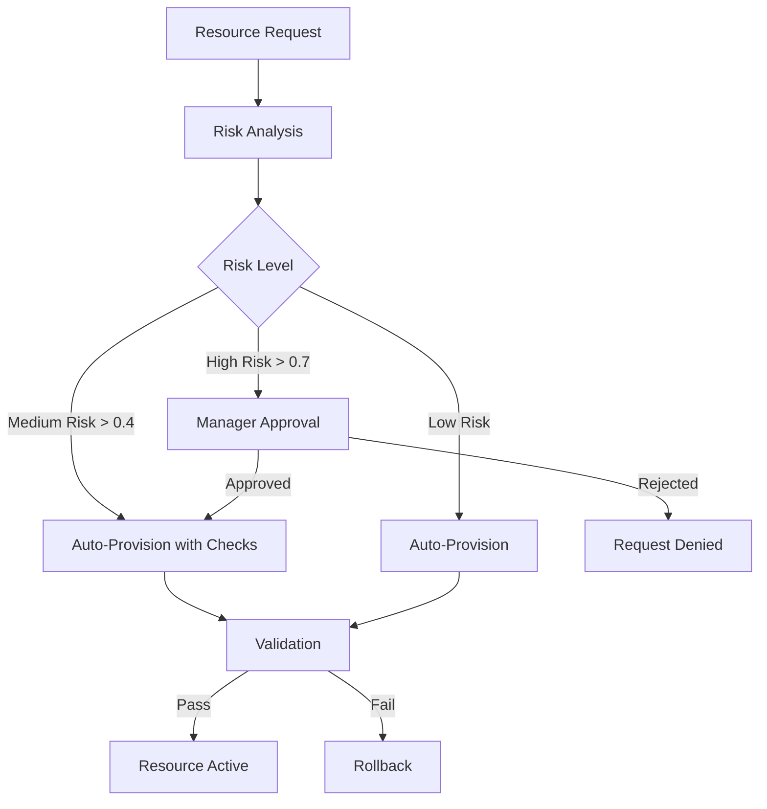
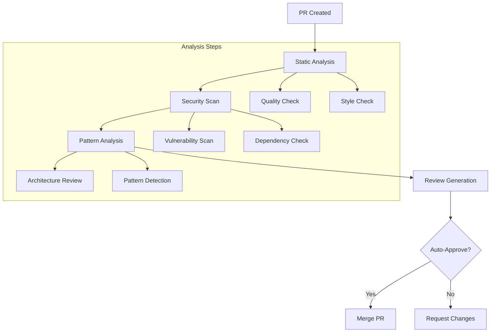
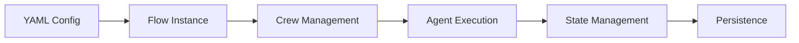

# Cognition Enterprise Flows

This directory contains enterprise-grade flows for automating complex business processes using AI-powered crews.

## Cloud Resource Management Flow

### Business Case
The Cloud Resource Management Flow automates and secures cloud infrastructure provisioning while ensuring compliance and risk management.

### Process Flow


### Key Features
- Risk-based approval routing
- Automated compliance checks
- Multi-level validation
- Audit trail generation
- Notification system integration

## Code Review Automation Flow

### Business Case
The Code Review Flow automates comprehensive code analysis and review processes, ensuring code quality, security, and maintainability.

### Process Flow


### Key Features
- Comprehensive code analysis
- Security vulnerability detection
- Pattern recognition
- Automated review comments
- Integration with GitHub/GitLab
- Custom approval conditions

## Technical Integration

### Flow Configuration


## Usage

1. Configure flow settings in `config/flows/`
2. Initialize flow through Cognition interface:
```python
from cognition import Cognition

cognition = Cognition()
result = cognition.code_review_flow().kickoff(
    inputs={
        "pr_number": 123,
        "repo": "org/repo"
    }
)
```

## Monitoring & Metrics

Both flows provide:
- Execution time tracking
- Success/failure rates
- Resource utilization metrics
- Audit trails
- Integration events

## Security & Compliance

- Role-based access control
- Audit logging
- Compliance checks
- Security scanning
- Approval workflows 