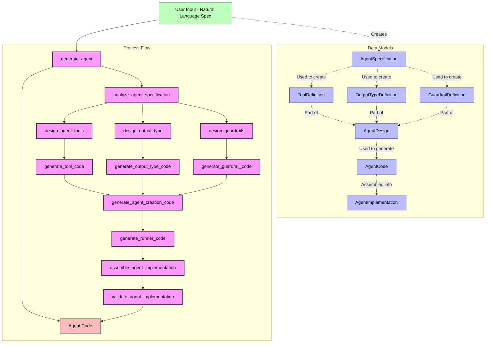

# OpenAI Agents SDK Meta Agent

This repository contains a meta agent designed to create other agents using the OpenAI Agents SDK. The meta agent takes a natural language description of an agent design and generates a fully functional agent that conforms to the OpenAI Agents SDK specifications.

## Overview

The OpenAI Agents SDK Meta Agent (or Agent Generator) is a sophisticated tool that leverages the OpenAI Agents SDK to create a system capable of designing and implementing other agents. It follows a multi-step process to transform natural language specifications into executable agent code.

## Features

- **Natural Language Input**: Describe the agent you want in plain English
- **Structured Design Process**: Converts specifications into detailed agent blueprints
- **Code Generation**: Produces complete, runnable Python code
- **Multi-Agent Architecture**: Uses specialized sub-agents for different parts of the process
- **Validation**: Includes validation to ensure generated agents work correctly

## Architecture

The meta agent is built using a multi-agent architecture with specialized agents for different parts of the process:

1. **Specification Analyzer**: Parses natural language descriptions into structured specifications
2. **Tool Designer**: Designs tools based on the agent's requirements
3. **Output Type Designer**: Creates structured output types when needed
4. **Guardrail Designer**: Implements appropriate guardrails for input/output validation
5. **Code Generators**: Generate code for tools, output types, guardrails, and agent creation
6. **Implementation Assembler**: Combines all components into a complete implementation
7. **Implementation Validator**: Validates the generated code for correctness

### System Flow Diagram



## Installation

### From Source

1. Clone the repository:
   ```bash
   git clone https://github.com/yourusername/meta-agent.git
   cd meta-agent
   ```

2. Install the package in development mode:
   ```bash
   pip install -e .
   ```

3. Set your OpenAI API key:
   ```bash
   export OPENAI_API_KEY="your-api-key"
   ```
   Or create a `.env` file in the project root with:
   ```
   OPENAI_API_KEY=your-api-key
   ```

### Using pip

```bash
pip install meta-agent
```

## Usage

```python
import asyncio
from meta_agent import generate_agent

async def main():
    specification = """
    Create a simple agent that responds to greetings.
    
    Name: GreetingAgent
    
    Description: A simple agent that responds to greetings in different languages.
    
    Instructions: You are a friendly greeting agent. When users greet you in any language,
    respond with an appropriate greeting in the same language. If you're not sure what
    language is being used, respond in English. Be warm and welcoming in your responses.
    
    Tools needed:
    1. detect_language: Detects the language of the input text
       - Parameters: text (string, required)
       - Returns: Language code (e.g., "en", "es", "fr")
    
    2. translate_greeting: Translates a greeting to the specified language
       - Parameters: greeting (string, required), language_code (string, required)
       - Returns: Translated greeting
    
    Output type: A simple text response
    
    Guardrails:
    - Ensure responses are appropriate and respectful
    - Validate that language codes are valid ISO codes
    """
    
    # Generate the agent
    implementation = await generate_agent(specification)
    
    # Print the implementation
    print("Agent implementation generated successfully!")
    print("\nMain file:")
    print(implementation.main_file[:500] + "..." if len(implementation.main_file) > 500 else implementation.main_file)

if __name__ == "__main__":
    asyncio.run(main())
```

## Package Structure

```
meta-agent/
├── meta_agent/             # Main package
│   ├── __init__.py         # Package initialization
│   ├── agent_generator.py  # Core agent generator
│   └── cli.py              # Command-line interface
├── tests/                  # Test directory
│   ├── __init__.py
│   └── test_agent_generator.py
├── agents/                 # Example agents (not included in package)
├── pyproject.toml          # Package configuration
├── setup.py                # Setup script for backward compatibility
├── MANIFEST.in             # Package manifest
├── requirements.txt        # Dependencies
└── README.md               # This file
```

## Running Tests

```bash
python -m tests.test_agent_generator
```

## Agent Specification Format

When describing your agent, include the following information:

- **Name**: A name for your agent
- **Description**: A brief description of what the agent does
- **Instructions**: Detailed instructions for the agent
- **Tools needed**: Description of the tools the agent should use
- **Output type** (optional): If the agent should use structured output
- **Guardrails** (optional): Validation rules for input/output
- **Handoffs** (optional): Other agents this agent can hand off to

## Example Specifications

### Weather Agent

```
Create a weather agent that can provide weather information for cities.

Name: WeatherAgent

Description: An agent that provides current weather information for cities worldwide.

Instructions: You are a helpful weather assistant. When users ask about the weather
in a specific city, use the get_weather tool to fetch that information. If they ask
for a forecast, use the get_forecast tool. Always provide temperatures in both
Celsius and Fahrenheit. If a city cannot be found, politely inform the user.

Tools needed:
1. get_weather: Fetches current weather for a city
   - Parameters: city (string, required)
   - Returns: Weather data including temperature, conditions, humidity

2. get_forecast: Fetches 5-day forecast for a city
   - Parameters: city (string, required), days (integer, optional, default=5)
   - Returns: Forecast data for each day

Output type: A structured response with weather information

Guardrails:
- Validate that city names are non-empty strings
- Check if the weather data contains sensitive information
```

### Research Agent

```
Create a research agent that can search for information and summarize findings.

Name: ResearchAgent

Description: An agent that can search for information on various topics and provide
summarized findings with citations.

Instructions: You are a research assistant. When users ask for information on a topic,
use the search_web tool to find relevant information. Summarize the findings in a
concise manner, providing citations for the sources used. If the topic is ambiguous,
ask for clarification. Always prioritize reliable sources.

Tools needed:
1. search_web: Searches the web for information
   - Parameters: query (string, required), num_results (integer, optional, default=5)
   - Returns: List of search results with titles, snippets, and URLs

2. extract_content: Extracts the main content from a URL
   - Parameters: url (string, required)
   - Returns: The extracted text content

3. summarize_text: Summarizes a long text
   - Parameters: text (string, required), max_length (integer, optional, default=200)
   - Returns: Summarized text

Output type: A structured response with research findings and citations

Guardrails:
- Validate that search queries are appropriate
- Ensure citations are included for all information
- Check for balanced viewpoints on controversial topics
```

## Implementation Details

The meta agent is implemented using the OpenAI Agents SDK and follows these key patterns:

1. **Deterministic Workflow**: The agent follows a deterministic workflow similar to the pattern in the SDK examples
2. **Structured Output**: Uses structured output types for each phase of the process
3. **Agents as Tools**: Specialized agents handle different parts of the process
4. **Guardrails**: Ensures the generated agents meet quality standards

## Limitations

- The meta agent requires a well-structured specification to generate effective agents
- Generated agents may require additional refinement for complex use cases
- Tool implementations may need to be customized for specific APIs or services

## Future Improvements

- Support for more complex agent architectures
- Better handling of edge cases in specifications
- More sophisticated validation of generated agents
- UI for easier agent creation and testing

## License

MIT
