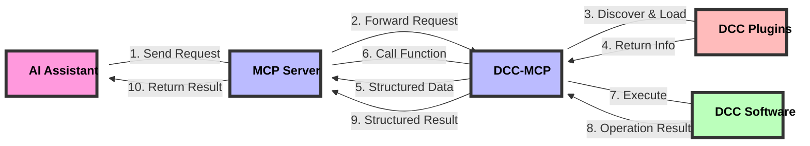

# dcc-mcp-core

Foundational library for the DCC Model Context Protocol (MCP) ecosystem. It provides common utilities, base classes, and shared functionality that are used across all other DCC-MCP packages.

## Design Philosophy and Workflow

DCC-MCP-Core is a plugin management system designed for Digital Content Creation (DCC) applications, aiming to provide a unified interface that allows AI to interact with various DCC software (such as Maya, Blender, Houdini, etc.).

### Core Workflow

1. **MCP Server**: Acts as a central coordinator, receiving requests from AI
2. **DCC-MCP**: Connects the MCP server and specific DCC software
3. **Plugin Discovery and Loading**: DCC-MCP-Core is responsible for discovering, loading, and managing plugins
4. **Structured Information Return**: Returns plugin information in an AI-friendly structured format to the MCP server
5. **Function Calls and Result Return**: MCP server calls the corresponding plugin functions and returns the results to AI



### Plugin Design

Plugins use a simple and intuitive design, allowing developers to easily create new DCC functionality:

- **Metadata Declaration**: Define basic plugin information through simple variables
- **Function Definition**: Implement specific DCC operation functionality
- **Context Passing**: Access DCC software's remote interface through the context parameter
- **Structured Return**: All functions return standardized structured data

### Remote Call Architecture

DCC-MCP-Core uses RPyC to implement remote procedure calls, allowing DCC operations to be executed in different processes or even on different machines:

- **Context Object**: Contains remote DCC client and command interface
- **Transparent Access**: Plugin code can access remote DCC APIs as if they were local
- **Error Handling**: Unified error handling mechanism ensures stable operation

## Features

- Parameter processing and validation
- Standardized logging system
- Common exception hierarchy
- Utility functions for DCC integration
- Version compatibility checking
- Plugin management system for DCC-specific functionality
- AI-friendly structured data interfaces
- Remote procedure call support via RPyC

## Requirements

- Python 3.7+
- Compatible with Windows, macOS, and Linux
- Designed to work within DCC software Python environments

## Installation

```bash
pip install dcc-mcp-core
```

## Usage

### Basic Usage

```python
from dcc_mcp_core.plugin_manager import create_plugin_manager
from dcc_mcp_core import filesystem

# Initialize a plugin manager for a specific DCC application
plugin_manager = create_plugin_manager("maya")

# Discover and load all available plugins
plugin_manager.discover_plugins()

# Get information about all loaded plugins (AI-friendly structured data)
plugins_info = plugin_manager.get_all_plugins_info()
for name, info in plugins_info.items():
    print(f"Plugin: {name}")
    print(f"  Version: {info['version']}")
    print(f"  Description: {info['description']}")
    print(f"  Functions: {len(info['functions'])}")

# Call a specific plugin function
result = plugin_manager.call_plugin_function(
    "maya_plugin",           # Plugin name
    "create_cube",           # Function name
    size=2.0,                # Function arguments
    context={"maya": True}   # Context for DCC integration
)

# Get custom plugin paths
plugin_paths = filesystem.get_plugin_paths()
```

### Plugin Management

The plugin management system allows you to discover, load, and interact with DCC-specific plugins:

```python
from dcc_mcp_core.plugin_manager import PluginManager

# Create a plugin manager for a specific DCC
manager = PluginManager('maya')

# Discover available plugins
plugin_paths = manager.discover_plugins()
print(f"Found {len(plugin_paths)} plugins for Maya")

# Load all discovered plugins
plugins_info = manager.load_plugins(plugin_paths)
print(f"Loaded plugins: {list(plugins_info.keys())}")

# Get structured information about plugins (AI-friendly format)
plugins_info = manager.get_plugins_info()

# Call a function from a specific plugin
result = manager.call_plugin_function('maya_scene_tools', 'create_primitive',
                                    context=context, primitive_type="cube", size=2.0)
```

### Creating Custom Plugins

Create a Python file with the following structure to make it discoverable by the plugin system:

```python
# my_maya_plugin.py

# Plugin metadata
__plugin_name__ = "My Maya Plugin"
__plugin_version__ = "1.0.0"
__plugin_description__ = "A custom plugin for Maya"
__plugin_author__ = "Your Name"
__plugin_requires__ = ["maya"]

# Using decorators to simplify plugin function development
from functools import wraps

def maya_tool(func):
    """Mark a function as a Maya tool, automatically handling the context parameter."""
    @wraps(func)
    def wrapper(context, *args, **kwargs):
        # Extract Maya client from context
        maya_client = context.get("maya_client")
        if not maya_client:
            return {"error": "Maya client not found"}

        # Call the original function
        try:
            return func(context, *args, **kwargs)
        except Exception as e:
            return {"status": "error", "message": str(e)}
    return wrapper

# Plugin functions
@maya_tool
def create_cube(context, size=1.0, position=None):
    """Create a cube in Maya."""
    cmds = context.get("maya_client").cmds

    if position is None:
        position = [0, 0, 0]

    # Create the cube
    cube = cmds.polyCube(w=size, h=size, d=size)[0]
    cmds.move(position[0], position[1], position[2], cube)

    return {
        "status": "success",
        "result": {
            "name": cube,
            "type": "cube",
            "size": size,
            "position": position
        }
    }
```

## License

MIT
