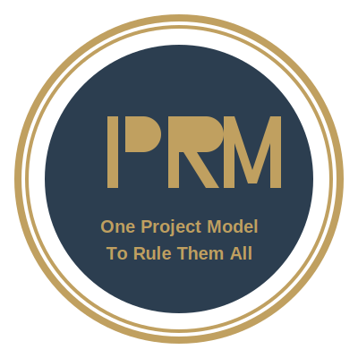

# Intermediate Project Representation Model



[](https://pypi.org/project/iprm/)

IPRM is to C++ build systems what LLVM is to CPU architectures.
The goal is not to be yet another a competitor to existing software in this space (e.g. CMake, Meson, Ninja, MSBuild,
GNU Make, QMake, SCons), just like
how LLVM is not a competitor to x86-64, Aarch64, and risc-v64. Instead, the goal is to be project
model/build system agnostic, enabling developer accessibility to a wide array of project
models/build systems via a common unified format. The actual project model or build
system used under the hood is up to the developer, allowing for ease of migration to
different backends, or to evaluate which backend is the most ideal for ones situation/preferences.

Developers act as the "compiler frontend", describing their large/complex C++ software project
in the .iprm format. Where-as typically an actual program is required/desired to emit the
intermediate representation, IPRM is designed so developers can do this manually because the
IPRM file format is just a python file that exposes an API tailor-made for all the varying tools
and strategies needed to describe C++ projects. IPRM then takes those files and acts as
the "compiler backend", taking its intermediate format and emitting a specific project model or
build system that can actually do the work of configuring, building, testing, and installing
C++ based projects

## Supported Systems

### Project Models

- CMake
- Meson

### Build Systems

- **(TODO)** SCons
- **(TODO)** MSBuild

### Miscellaneous 

- **(TODO)** Graphviz

## Supported Languages
- C++
- Rust*

> [!NOTE]
> *Rust support being native vs custom targets invoking `cargo` or `rustc` manually depends on the systems mentioned 
> above. For example, Meson does have native support, while CMake currently does not.

## Getting Started

```
pip install iprm
```

[Skip to examples section](#usage) if you just want to use the latest version of IPRM for your own projects. If you want to build from source and/or contribute, continue into the following section.  


### Building

> [!NOTE]
> IPRM is "self-hosted", so a [recent version](https://pypi.org/project/iprm/) is required to build the latest source

### Pre-requisites

- C++ 20
- [Python 3.12](https://www.python.org/downloads/)
- [Rust 1.85](https://rustup.rs/)*

> [!NOTE]
> *Rust is only required if you want to build and run the tests, IPRM itself only requires C++ and Python

> [!WARNING]
> It's strongly recommended to install Python packages in a virtual environment to avoid conflicts with system
packages. You can create and activate a virtual environment with:
> ```
> python -m venv .venv
> 
> # On Windows
> .venv\Scripts\activate
> 
> # On Unix/macOS
> source .venv/bin/activate
> ```

#### Editable Python Package
```
pip install -e . [--verbose]

# NOTE: If don't you have Rust installed, a lot of these tests will fail
pytest
```


## Usage
See the [tests](tests/) folder for the data used for the following examples
### Command Line Interface
**TODO**: Go through example of building a project via CLI, step by step commands
`iprm --help`

### Graphic User Interface (Studio)
**TODO**: Show short demo snippets of the equivalent actions done in Studio that was done above
`iprm-studio --help`


**TODO**: Actually implement the remote infrastructure
**TODO**: Show how to set up/configure the remote workers via CLI 
(using flags or environment variables) and via Studio (using the default 
browser to perform the oauth 2.0)
### Remote Web
`iprm-web --help`

### Remote Worker
`iprm-worker --help`
