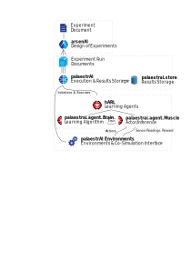

palaestrAI Quick Start Guide
============================

palaestrAI is a feature rich framework for learning agents, especially
including Deep-Reinforcement-based agents. The focus is to enable training
of multiple agent cat the same time, inspired by the ARL principle.

Bird's-Eye View
---------------

palaestrAI is an ecosystem consisting of a number of packages for different
purposes.

A central idea to the whole framework is a proper experimentation process.
That means a design of experiments, in which you create an *experiment*
document and apply sampling strategies to the factors designed therein.
*aresenAI* implements this and creates *experiment run* definitions.

If design of experiments isn't your forté, don't worry: You can simply
create an *experiment run* file and execute it. You will achieve a fully
reproducible simulation, with all results data safely stored away. For this
whole execution & data storage process, *palaestrAI* proper (the core
framework) is responsible.

A experiment run execution entails creating a simulation controller,
initializing environments, and also initializing agents that act in this
environment. The experiment run file defines all these, i.e., which
environment to load, what agents participate in a run, and of course, their
parameters. If you want to conduct experiments with already implemented
agents and environments, creating this file is where you should begin.

In palaestrAI, agents consists of a brain and muscles. This split between
learning & training (brain) and inference and acting (muscle) is intentional,
as it allows easily switching training algorithms, multi-worker or async
learning, and distributed execution. Agents (i.e., brain-muscle
implementations) live in the *hARL* package. If you are interesting in
implementing new algorithms, have a closer look at the :class:`Brain` and
:class:`Muscle` classes.

Finally, :class:`Environment` is the base class for all environments.
Consider its API documentation if you intend to create your own.

The following sections will guide you through the different parts of
setting up and executing an experiment run.

Experiment, Simulation, Phases, Episodes
----------------------------------------

palaestrAI is structured in a hierarchical way. On the top is the experiment
(file) which defines all components and variables. This file is used to create a
design of experiments by using arsenAI. arsenAI creates a number of experiment
run files. If you don't use a design of experiment then you can skip this step
and you can create your run file by yourself. One example is shown in this
tutorial. Every experiment run is independent from all other experiment runs,
they are copies of each other with modified variables.

An experiment run is the closest thing to a classic DRL training you might
already know from OpenAIs Gym or comparable frameworks. A experiment run
contains one or more phases, normally it contains at least two phases. A
training phase and a test phase. Each phase can have one or more episodes, if a
episode ends the phase gets restarted, this continuous until the maximum number
of episodes is reached. At that point the next phase starts or the run has
finished.

Termination
-----------

Both an experiment run and a phase can have a termination condition. Currently,
we have implemented the most basic termination conditions. At the experiment run
level, the condition is satisfied when all phases are finished. At the phase
level, the termination condition is satisfied when all episodes have ended. The
end of an episode is currently defined by the environment, which itself has a
maximum number of steps and termination conditions. For example, the Midas
environment terminates after X simulation steps or if the load flow calculation
fails. However, many more conditions are possible, such as termination when a
certain reward is reached, time-based termination at each level, and more.

palaestrAI Experiment
---------------------

To use palaestrai you need a experiment file. You can either create one
experiment file or use arsenai if you want to create a more complex design of
experiment. In the end you need at least one experiment YAML file. The YAML file
is segmented in a general part, this are settings which are on a experiment
level. Each experiment can have multiple phases. A common structure is one
training phase followed by one test phase but different setups are possible.
Each phase is structured in different components. Each component can be
configured.

This is an example for an experiment YAML file. Each file has a user defined id
*uid* which can be used to identify an experiment in the store. You should also
set a main seed (*seed*) which is used to derive individual seeds for e.g.
agents or the environment. The seeds are used for random number generators to
provide reproducibility. Many deep reinforcement learning algorithms are
sensible to the used seed, it is always a good idea to test multiple seeds to
ensure a good/bad performance is not the result of a good/bad seed. The
*version* is the targeted palaestrai version, if you have a different version
installed as the targeted version in the yaml you will receive a warning.

.. code-block:: yaml

    # Very simple dummy experiment run. Does nothing except for exercising
    # all relevant components of the software.
    # Do not change it! But you can copy it and modify it to your needs,
    # of course. :^)

    uid: "Yo-ho, a dummy experiment run for me!"# User defined ID
    seed: 42  # The random seed, as usual
    # Version of palaestrai this run file is compatible with
    # Just a check and a log message if versions do not match
    version: 3.4
    schedule:  # The schedule for this run; it is a list
      - phase_0:  # Name of the current phase. Can be any user-chosen name
          environments:  # Definition of the environments for this phase
            - environment:
                name: palaestrai.environment.dummy_environment:DummyEnvironment
                uid: myenv
                params: {"discrete": true}
          agents:  # Definition of agents for this phase
            - name: mighty_defender
              brain:
                name: palaestrai.agent.dummy_brain:DummyBrain
                params: { "store_path": "./custom" } # the base store path
              muscle:
                name: palaestrai.agent.dummy_muscle:DummyMuscle
                params: { }
              objective:
                name: palaestrai.agent.dummy_objective:DummyObjective
                params: {"params": 1}
              sensors: [myenv.0, myenv.1, myenv.2, myenv.3, myenv.4]
              actuators: [myenv.0, myenv.1, myenv.2, myenv.3, myenv.4]
            - name: evil_attacker
              brain:
                name: palaestrai.agent.dummy_brain:DummyBrain
                params: { }
              muscle:
                name: palaestrai.agent.dummy_muscle:DummyMuscle
                params: { }
              objective:
                name: palaestrai.agent.dummy_objective:DummyObjective
                params: {"params": 1}
              sensors: [myenv.5, myenv.6, myenv.7, myenv.8, myenv.9]
              actuators: [myenv.5, myenv.6, myenv.7, myenv.8, myenv.9]
          simulation:  # Definition of the simulation controller for this phase
            name: palaestrai.simulation:VanillaSimController
            conditions:
              - name: palaestrai.simulation:VanillaSimControllerTerminationCondition
                params: {}
          phase_config:  # Additional config for this phase
            mode: train
            worker: 1
            episodes: 1
      - phase_1:  # Name of the current phase. Can be any user-chosen name
          environments:  # Definition of the environments for this phase
            - environment:
                name: palaestrai.environment.dummy_environment:DummyEnvironment
                uid: myenv
                params: {"discrete": true}
          agents:  # Definition of agents for this phase
            - name: mighty_defender
              # we load the agent with the same name and the same experiment_id, optional: specify "agent_name" or "experiment_id"
              load: {base: "./custom", phase_name: "phase_0"}
              brain:
                name: palaestrai.agent.dummy_brain:DummyBrain
                params: { "store_path": "./custom" }
              muscle:
                name: palaestrai.agent.dummy_muscle:DummyMuscle
                params: { }
              objective:
                name: palaestrai.agent.dummy_objective:DummyObjective
                params: {"params": 1}
              sensors: [myenv.0, myenv.1, myenv.2, myenv.3, myenv.4]
              actuators: [myenv.0, myenv.1, myenv.2, myenv.3, myenv.4]
            - name: evil_attacker
              load: {phase_name: "phase_0"}
              brain:
                name: palaestrai.agent.dummy_brain:DummyBrain
                params: { }
              muscle:
                name: palaestrai.agent.dummy_muscle:DummyMuscle
                params: { }
              objective:
                name: palaestrai.agent.dummy_objective:DummyObjective
                params: {"params": 1}
              sensors: [myenv.5, myenv.6, myenv.7, myenv.8, myenv.9]
              actuators: [myenv.5, myenv.6, myenv.7, myenv.8, myenv.9]
          simulation:  # Definition of the simulation controller for this phase
            name: palaestrai.simulation:VanillaSimController
            conditions:
              - name: palaestrai.simulation:VanillaSimControllerTerminationCondition
                params: {}
          phase_config:  # Additional config for this phase
            mode: train
            worker: 1
            episodes: 1
    run_config:  # Not a runTIME config
      condition:
        name: palaestrai.experiment:VanillaRunGovernorTerminationCondition
        params: {}

There is also a *run_config* which contains the Termination Condition of the
experiment. Currently there is just one termination condition available. If you
want to implement one for yourself, you add it here by changing the *name* to
the path of your new condition.

Schedule
~~~~~~~~

.. code-block:: yaml

    schedule:  # The schedule for this run; it is a list
      - phase_0:  # Name of the current phase. Can be any user-chosen name
          environments:  # Definition of the environments for this phase
            [...]
          agents:  # Definition of agents for this phase
            [...]
          simulation:  # Definition of the simulation controller for this phase
            [...]
          phase_config:  # Additional config for this phase
            mode: train
            worker: 1
            episodes: 1
      - phase_1:  # Name of the current phase. Can be any user-chosen name
          environments:  # Definition of the environments for this phase
            [...]
          agents:  # Definition of agents for this phase
            [...]
          simulation:  # Definition of the simulation controller for this phase
            [...]
          phase_config:  # Additional config for this phase
            mode: train
            worker: 1
            episodes: 1

The schedule defines how the experiment is executed. There is only one schedule,
which contains at least one phase. Every phase is defined by an unique name
which can be chosen without restrictions. In this example the two phases are
named *phase_0* and *phase_1*. Every phase contains **at least** one
environment, **at least** one agent, **exactly** one simulation configuration
and **exactly** one phase_config. Phases which build on each other can be
overwritten, more on that is in chapter *Overwriting Values*

Simulation
~~~~~~~~~~

The simulation controller controls the experiment and is configured in the
simulation block. It contains two components, the simulation controller itself
and a termination condition which defines when a simulation run/episode has
ended. Currently there is only one of each implemented.

.. code-block:: yaml

    simulation:  # Definition of the simulation controller for this phase
                name: palaestrai.simulation:VanillaSimController
                conditions:
                  - name: palaestrai.simulation:VanillaSimControllerTerminationCondition
                    params: {}

Agents
~~~~~~

The agents block contains all agents which act at the same time. In the basic
ARL scenario there are two agents. The first one is the defender, the second one
is the attacker.

.. code-block:: yaml

    agents:  # Definition of agents for this phase
            - name: mighty_defender
              # we load the agent with the same name and the same experiment_id, optional: specify "agent_name" or "experiment_id"
              load: {base: "./custom", phase_name: "phase_0"}
              brain:
                name: palaestrai.agent.dummy_brain:DummyBrain
                params: { "store_path": "./custom" }
              muscle:
                name: palaestrai.agent.dummy_muscle:DummyMuscle
                params: { }
              objective:
                name: palaestrai.agent.dummy_objective:DummyObjective
                params: {"params": 1}
              sensors: [myenv.0, myenv.1, myenv.2, myenv.3, myenv.4]
              actuators: [myenv.0, myenv.1, myenv.2, myenv.3, myenv.4]
            - name: evil_attacker
              load: {phase_name: "phase_0"}
              brain:
                name: palaestrai.agent.dummy_brain:DummyBrain
                params: { }
              muscle:
                name: palaestrai.agent.dummy_muscle:DummyMuscle
                params: { }
              objective:
                name: palaestrai.agent.dummy_objective:DummyObjective
                params: {"params": 1}
              sensors: [myenv.5, myenv.6, myenv.7, myenv.8, myenv.9]
              actuators: [myenv.5, myenv.6, myenv.7, myenv.8, myenv.9]

Every agent is defined by a unique name. In this example, the first agent
is called ``mighty_defender``. The ``load`` parameter defines a local path
which is used to load model files. This is needed if you have multiple
episodes or at least one test phase.

The parameters ``brain`` and ``muscle`` are used to define the algorithm of
the agent. It is most likely that you use the corresponding brains and
muscles (e.g. a TD3 Brain with a TD3 Muscle). But there might be cases in
which there are multiple Brains/Muscles of the same algorithm, e.g., a
multi-agent Brain, or a Muscle that includes a preprocessing step. In that
case you can define it here. For this, you should use the path to the class
that should be loaded. In this example, the muscle and brain are part of
the ``palaestrai.agent`` package, and the dummy brain and muscle should be
loaded.

Another common package is the *hARL* package in which you can find already
implemented DRL Algorithms. Each brain/muscle can have parameters; the
brain should at least have a ``store_path`` parameter. This parameter has to
match the ``load_path``.

.. note::
    In the future, the store will be used for loading and
    storing the brain dumps, but this is currently work in progress. As such,
    expect this part of the API change in a future version.

Every Agent needs an *objective*. The objective calculates the internal
reward. This internal reward is what is closest to the traditional reward.
The purpose of the objective is to evaluate the last action together with the
old (and new) state with respect to the agent's objective. While the
environment reward is rating the current state of the reward with no respect
to the action of the agents. An objective can have parameters.

At last every Agent needs at least one *sensor* and one *actuator*, but is not
limited to one. The sensors and actuators are defined as list and identified
by their ids. The ID is a combination of the environment uid
(which is defined in the environment block) and the name of the sensor. In
our case the environment has the uid ``myenv`` and the sensor names are
numbers from 0 to 9. So the first sensor is ``myenv.0``. The same is applied
to the actuators. You have to know both, the env uid and the
sensor/actuator names, when you create your environment.

.. warning::
    Make sure, that sensors and actuators don't change between phases.
    Currently, no  implemented algorithm provides transfer-learning.
    Also make sure that the order is the same.

You can define as many Agents as you want, currently the actuators are
exclusive (defined by the VanillaSimulationController).
So if two agents share the same actuator the last received value is used.

Environment
~~~~~~~~~~~

In the environment block, one or more environments can be defined. Those
environments will be executed in parallel, but no data exchange between them is
performed by palaestrAI.

.. code-block:: yaml

  environments:  # Definition of the environments for this phase
    - environment:
        name: palaestrai.environment.dummy_environment:DummyEnvironment
        uid: myenv
        params: {"discrete": true}

The key ``environments`` holds a list of environments to be defined. Each
environment expects to have a single key ``environment``, followed by another
dictionary of key-value pairs as value. Each environment is defined by at least
a ``name``, a ``uid`` and a dictionary ``params`` (which might also be empty).

The ``name`` is a an import string with
a specific syntax. The modules are separated by dots and the class is appended
with double colon. The example name would be translated to following python
import command:

.. code-block:: python

  from palaestrai.environment.dummy_environment import DummyEnvironment

When you want to use a different environment, make sure that your environment
can be found in the python path.

The ``uid`` is an important parameter, especially when more than one environment
is used. You can choose any name here but, for convenience, it should not be too
long. The ``uid`` is used when assigning sensors and actuators to agents.

Finally, ``params`` is a dictionary that may contain any key/value pair required
by the environment. In the example, we have only one parameter, which allows to
use discrete instead of continuous values in the environment.

Cascading Settings Expansion
~~~~~~~~~~~~~~~~~~~~~~~~~~~~

The experiment run files of palaestrAI support a lazy-style definition of the
schedule's phases. This means you can skip definitions already done in a
previous phase. Let's have a look at an example to show how exactly this
works.

.. code-block:: yaml

    schedule:  # The schedule for this run; it is a list
      - phase_0:  # Name of the current phase. Can be any user-chosen name
          environments:  # Definition of the environments for this phase
            [...]
          agents:  # Definition of agents for this phase
            [...]
          simulation:  # Definition of the simulation controller for this phase
            [...]
          phase_config:  # Additional config for this phase
            mode: train
            worker: 1
            episodes: 1
      - phase_1:  # Name of the current phase. Can be any user-chosen name
          environments:  # Definition of the environments for this phase
            [...]
          agents:  # Definition of agents for this phase
            [...]
          simulation:  # Definition of the simulation controller for this phase
            [...]
          phase_config:  # Additional config for this phase
            mode: test
            worker: 1
            episodes: 1

This is the config we saw earlier. Without considering the configurations of
environments, agents, and simulation, the only thing that differs between the
phases is the ``mode`` key in the ``phase_config``. The following config is
equivalent to the config above:

.. code-block:: yaml

    schedule:  # The schedule for this run; it is a list
      - phase_0:  # Name of the current phase. Can be any user-chosen name
          environments:  # Definition of the environments for this phase
            [...]
          agents:  # Definition of agents for this phase
            [...]
          simulation:  # Definition of the simulation controller for this phase
            [...]
          phase_config:  # Additional config for this phase
            mode: train
            worker: 1
            episodes: 1
      - phase_1:  # Name of the current phase. Can be any user-chosen name
          phase_config:  # Additional config for this phase
            mode: test

The general rule for overwriting is: if the value **is not** some kind of
dictionary, the existing value will be overwritten. If the value was not present
before, it will be added. If the value **is** some kind of dictionary, the
overwrite function is called with this value, again. This is done for an
arbitrary depth of the initial dictionary.

The process to build the full configuration always looks like:

.. code-block:: python

  # Python-like pseudo code

  def build_full_config(schedule):

    full_config = list()
    previous_config = dict()

    for current_config in schedule.get_next_phase():

      # Reuse values from the previous config, which is empty in the first
      # iteration
      current_config.copy_and_update_from(previous_config)

      # Add the current-and-updated config to the full config
      full_config.append(current_config)

      # Store a reference to the current config for the next iteration
      previous_config = current_config

    return full_config

This means, if you have more than two phases, the third phase will copy the
entries from the second phase, which has copied the entries from the first
phase. Or, in other words, unless you change something, the config for the
phases are the same.

Store and Database Model
------------------------

Connecting to the Database
~~~~~~~~~~~~~~~~~~~~~~~~~~

The ‘store’ is the module that safes all experiment data: It is palaestrAI's
storage backend. ‘Store’ is a play on words with the ‘general store:’ You can
get almost anything (any data) from it!

Connecting to the store is easy: One you've set the ``store_uri`` in the
runtime config, a session object can be retrieved like this:

.. code-block:: python

    import palaestrai.store
    session = palaestrai.store.Session()

Accessing Data: The Database Model
~~~~~~~~~~~~~~~~~~~~~~~~~~~~~~~~~~

palaestrAI's database model is implemented using `SQLAlchemy's
Object-Relational Mapper (ORM) <https://docs.sqlalchemy.org/en/14/orm/>`_. The
ORM's hierarchy mirrors the structure of the palaestrAI ecosystem:

1. The store contains *experiment* documents
2. An *experiment* document has many associated *experiment run* documents
3. Each *experiment run* has one to many *experiment run instances*
4. *Experiment run instances* contain *experiment run phases*
5. In the hierarchy below *experiment run phases*, the store contains
   definitions of *environments* and *agents*
6. For each *environment* that participates in an *experiment run phase*,
   *world states* are stored
7. Each *agent* participating in an *experiment run phase* stores
   *muscle actions* and *brain states*.

.. note::

    **Experiment run instances** represent executions (and re-executions)
    of a particular experiment run. Since you can issue
    ``palaestrai experiment-start my_experiment.yml`` several times, or even
    several users can do so independently, it is important to distinguish
    executions of an experiment run from the actual definition.

.. eralchemy::

Once you have a database session object, you can use `SQLAlchemy's ORM
query facilities <https://docs.sqlalchemy.org/en/14/orm/queryguide.html>`_ to
retrieve values of an experiment. For more information, refer to the extended
`documentation of the store <store.rst>`_.