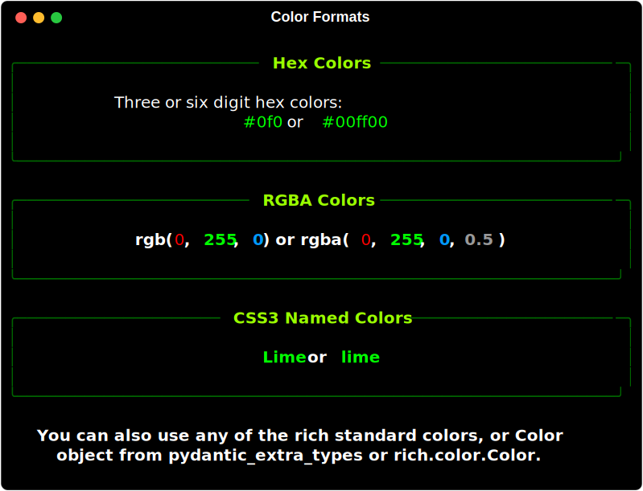
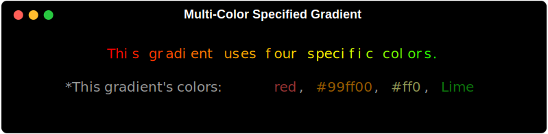

# 

<div class="badges">
    <a href="https://github.com/astral-sh/uv"></a>
    <a href="https://GitHub.com/maxludden/maxgradient"></a>
    <a href="https://GitHub.com/maxludden/rich-gradient"></a>
    <a href="https://GitHub.com/maxludden/rich-gradient"></a>
</div>
<div id="spacer"></div>


This library is a wrapper of the great [rich](https://GitHub.com/textualize/rich) library that extends [rich.text.Text](https://github.com/Textualize/rich/blob/master/rich/text.py) to allow for the easy generation gradient text from either user entered colors or randomly if no colors are entered.

Borrowing from [pydantic-extra-types](https://GitHub.com/pydantic/pydantic-extra-types)' [Color](https://github.com/pydantic/pydantic-extra-types/blob/main/pydantic_extra_types/color.py) class, rich_gradient extends the rich standard colors to include:

- 3 or 6 digit hex code (e.g. `#f00` or `#ff0000`)
- RGB color codes (e.g. `rgb(255, 0, 0)`)
- RGB tuples   (e.g. `(255, 0, 0)`)
- CSS3 Color Names (e.g. `red`)

## Installation

### uv (Recommended)

```bash
uv add rich-gradient
```

### Pip

```bash
pip install rich-gradient
```

## Usage

### Basic Gradient Example

To print a simple gradient just substitue the `Gradient` class for the `Text` class in the rich library.

```python
from rich.console import Console
from rich_gradient import Gradient

console = Console()
console.print(Gradient("Hello, World!")
```


---

### Gradient with Specific Colors

If you want a bit more control of the gradient, you can specify the colors you want to use in the gradient by passing them as a list of colors to the `colors` parameter.

#### Color Formats

Color can be parsed from a variety of formats including:



#### Example Code

```python
console.print(
    Gradient(
        "This a gradient with specific colors.",
        colors=["red", "#ff9900", "#ff0", "Lime"],
        justify="center"
    )
)
```

#### Specific Color Gradient Result



---

### Rainbow Gradient Example

If four colors isn't enough, you can use the 'rainbow' parameter to generate a rainbow gradient that spans the entire spectrum of colors randomly.

```python
console.print(
    Gradient(
        "This is a rainbow gradient.",
        rainbow=True,
        justify="center"
    )
)
```


<p style="text-align:right;">*The rainbow gradient is generated randomly each time the code is run.</p>

---

### Still inherits from `rich.text.Text`

Since `Gradient` is a subclass of `Text`, you can still use all the same methods and properties as you would with `Text`.

```python
console.print(
    Gradient(
        "This is an underlined rainbow gradient.",
        rainbow=True,
        style="underline"
    ),
    justify="center"
)
console.line()
console.print(
    Gradient(
        "This is a bold italic gradient.",
        style="bold italic"
    ),
    justify="center"
)
console.line()
```


