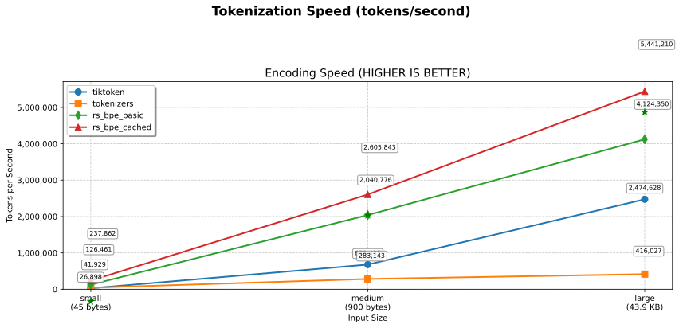
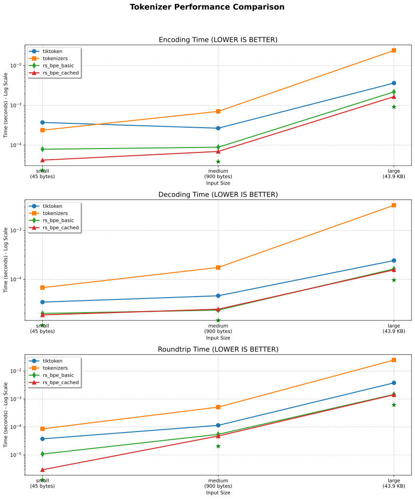
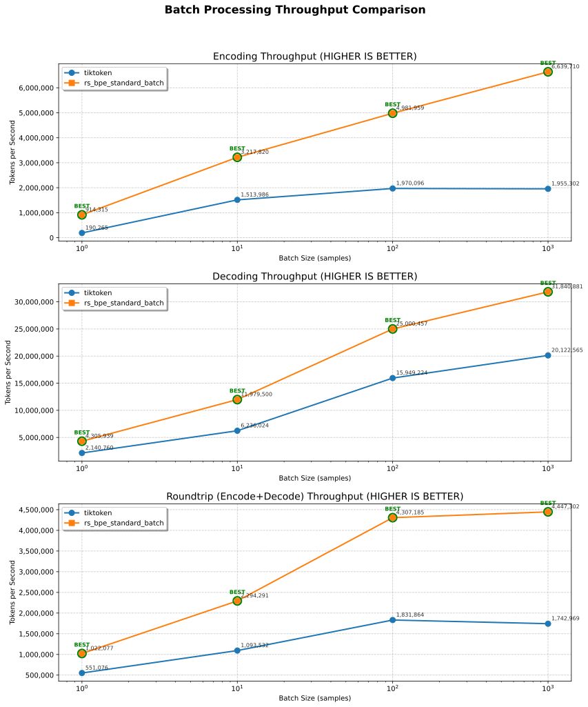

[](https://github.com/gweidart/rs-bpe/actions/workflows/ci.yml) &nbsp; [](https://github.com/gweidart/rs-bpe/actions/workflows/release.yml)

The main purpose of this library is to provide fast and correct token counting for chunking algorithms with a focus on high performance. It implements novel algorithms for BPE tokenization that are both correct and significantly faster than existing solutions.

#### Installation

##### Python Package

```
pip install rs-bpe
```

*rs_bpe consistently outperforms the latest release of both tiktoken and huggingface's tokenizers (March 18, 2025)*



## Key Features

* Efficient token counting with linear time complexity even for adversarial inputs
* Split text at exact token boundaries while respecting UTF-8 character boundaries
* Incrementally count tokens while appending text to a chunk
* Calculate token counts for sub-ranges of text with constant-time complexity
* Python bindings with OpenAI-compatible interface

These operations are particularly important for LLM applications but are challenging to implement efficiently for BPE tokenization.

## Motivation *(problems rs-bpe aims to solve)*

Existing BPE tokenizers often face performance and correctness issues when used for chunking operations:

### Split-at-N-Tokens Problem

Naively splitting text after N tokens by first encoding the entire text and then selecting a boundary often produces suboptimal results:

* The split point might not align with a UTF-8 character boundary
* Dropping tokens until a character boundary is reached might result in chunks much shorter than desired
* The algorithm wastes resources by encoding more text than necessary

### Incremental Counting Problem

Incrementally counting tokens as text is appended is challenging with traditional implementations:

* Recomputing the encoding after every append leads to quadratic complexity
* Approximating counts by aggregating piece counts leads to incorrect results due to BPE's non-monotonic nature
* Incorrect counting can cause problems when staying within token limits for LLM APIs

### Interval Counting Problem

Counting tokens for arbitrary subranges traditionally requires reprocessing the entire substring:

* Leads to poor performance for applications that need to count many subranges
* Makes operations like binary search for token boundaries inefficient

Our library provides novel algorithms to solve these problems with superior performance characteristics.

## Implementation

The rs-bpe library is written in Rust with Python bindings, designed for both speed and correctness. It implements several encoding strategies:

### Core Algorithm

Our novel algorithm achieves O(n) complexity while preserving the exact output of the original BPE algorithm. The key insight is tracking encodings of all text prefixes efficiently using mathematical properties of valid BPE encodings.

Instead of storing full token sequences for each prefix, we only need to remember the last token of each prefix. This is possible because:

1. There exists exactly one valid encoding sequence for any input text
2. Any substring of a valid encoding sequence is itself a valid encoding sequence
3. Knowing the last token of a valid encoding sequence uniquely determines the full sequence

The algorithm efficiently determines the correct last token for each prefix by checking token compatibility with the preceding token, leading to a linear-time solution.

### Backtracking Optimization

For average-case performance improvement, the library implements a backtracking-based algorithm that:

1. Tries the greedy approach first, using the longest matching token at each step
2. Backtracks when necessary to ensure valid BPE encoding
3. Uses a bitfield to make runtime linear in the input length

### Special Purpose Encoders

The library provides specialized encoders for specific use cases:

* **AppendableEncoder**: Maintains token count state while appending text character by character
* **IntervalEncoding**: Preprocesses text once to enable constant-time token counting for any substring
* **BacktrackEncoder**: Provides the fastest correct implementation for general encoding
* **OpenAI-compatible Tokenizer**: Implements tiktoken-compatible interface with cl100k and o200k models

## Performance

Our benchmarks show significant performance improvements over existing implementations:

> **Note**: All benchmark results shown here were achieved using the Python bindings, not the direct Rust implementation. This provides a more realistic representation of the performance users will experience in Python applications. Many libraries release benchmarks based solely on their native implementation, which can be misleading as the language boundary crossing adds overhead.

### Single-Text Tokenization

Internal benchmarks show rs-bpe outperforms existing tokenizers across all text sizes:


| Text Size | rs-bpe\_cached vs tiktoken | rs-bpe\_cached vs HuggingFace |
| ----------- | ---------------------------- | ------------------------------- |
| Small     | 15.1x faster               | 7.6x faster                   |
| Medium    | 3.7x faster                | 8.8x faster                   |
| Large     | 2.2x faster                | 14.0x faster                  |

_Encoding speed (benchmark.py results):


_

```
SMALL TEXT:
  tiktoken: 0.000605s
  tokenizers: 0.000305s
  rs_bpe_basic: 0.000095s
  rs_bpe_cached: 0.000040s

MEDIUM TEXT:
  tiktoken: 0.000287s
  tokenizers: 0.000677s
  rs_bpe_basic: 0.000096s
  rs_bpe_cached: 0.000077s

LARGE TEXT:
  tiktoken: 0.003613s
  tokenizers: 0.023054s
  rs_bpe_basic: 0.001438s
  rs_bpe_cached: 0.001652s
```

The rs-bpe library also provides significantly faster decoding and roundtrip operations:

_Decoding speed:




_

```
LARGE TEXT:
  tiktoken: 0.000257s
  tokenizers: 0.003614s
  rs_bpe_basic: 0.000184s
  rs_bpe_cached: 0.000158s
```

### Batch Processing Performance

rs-bpe provides efficient batch processing that scales better with batch size:


| Batch Size | Encoding Speedup | Decoding Speedup | Roundtrip Speedup |
| ------------ | ------------------ | ------------------ | ------------------- |
| 1          | 5.1x faster      | 2.6x faster      | 1.7x faster       |
| 10         | 2.8x faster      | 1.6x faster      | 2.1x faster       |
| 100        | 3.0x faster      | 1.3x faster      | 2.3x faster       |
| 1000       | 3.1x faster      | 1.8x faster      | 2.5x faster       |

_Throughput comparison (tokens per second):




_

```
BATCH SIZE 1000:
  tiktoken: 0.032521s, 1,970,002 tokens/sec
  rs_bpe_standard_batch: 0.010663s, 6,008,200 tokens/sec
```

### Worst-Case Performance

While tiktoken shows quadratic growth for certain adversarial inputs, rs-bpe maintains linear scaling even in worst-case scenarios. This is critical for production systems that need consistent performance guarantees.

### Key Performance Advantages

1. **Memory Efficiency**: The implementation uses compact data structures and avoids redundant token storage
2. **Thread Pool Optimization**: Batch processing uses an optimized thread pool with smart worker allocation
3. **Caching**: The library includes intelligent state caching for repeated operations
4. **No Correctness Trade-offs**: Unlike some implementations that sacrifice correctness for speed, rs-bpe is both fast and correct

All benchmarks were run on standard hardware and results may vary based on your specific environment.

## Python Usage Examples

### Basic Tokenization

```python
from rs_bpe.bpe import openai

# Load OpenAI tokenizers (automatically caches for reuse)
cl100k_tokenizer = openai.cl100k_base()  # GPT-3.5/4 tokenizer
o200k_tokenizer = openai.o200k_base()    # o200k tokenizer

# Basic encoding
text = "Hello, world! This is an example."
tokens = cl100k_tokenizer.encode(text)
print(f"Encoded tokens: {tokens}")

# Basic decoding
decoded_text = cl100k_tokenizer.decode(tokens)
print(f"Decoded text: {decoded_text}")

# Simple token counting
token_count = cl100k_tokenizer.count(text)
print(f"Token count: {token_count}")
```

### Efficient Token Limiting

One of the key features of rs-bpe is the ability to efficiently count tokens up to a limit, which is useful when you need to stay within token constraints:

```python
from rs_bpe.bpe import openai

tokenizer = openai.cl100k_base()
max_tokens = 50

# Count tokens until limit is reached
text = "This is a long text that might exceed our token limit... " * 20
char_position = tokenizer.count_till_limit(text, max_tokens)

if char_position is not None:
    # We reached the limit before the end of the text
    truncated_text = text[:char_position]
    print(f"Truncated to {tokenizer.count(truncated_text)} tokens")
    print(f"Truncated text: {truncated_text}")
else:
    # The entire text is within our token limit
    print(f"Text is within token limit: {tokenizer.count(text)} tokens")
```

### Batch Processing

rs-bpe excels at batch processing with automatic parallelization, which is perfect for processing large datasets:

```python
from rs_bpe.bpe import openai
import time

# Load the tokenizer
tokenizer = openai.cl100k_base()

# Create a batch of texts
texts = [
    "This is the first document to encode.",
    "Here's another one with different content.",
    "A third document with some more text to process.",
    # Add more as needed...
]

# Configure parallel processing options (optional)
parallel_options = openai.ParallelOptions(
    min_batch_size=20,      # Minimum batch size to engage parallel processing
    chunk_size=100,         # Number of texts to process in each thread
    max_threads=0,          # 0 means use optimal thread count (based on CPU cores)
    use_thread_pool=True    # Reuse thread pool for better performance
)

# Encode batch with performance metrics
start_time = time.time()
result = tokenizer.encode_batch(texts, parallel_options)
end_time = time.time()

print(f"Processed {len(texts)} texts in {result.time_taken:.6f}s")
print(f"Total tokens: {result.total_tokens}")
print(f"Throughput: {result.total_tokens / result.time_taken:.1f} tokens/second")

# Access individual token lists
for i, tokens in enumerate(result.tokens):
    print(f"Text {i} has {len(tokens)} tokens")
```

### Advanced Usage: Checking Token Compatibility

For specialized applications, you might need to check if a text can be tokenized within a specific token limit:

```python
from rs_bpe.bpe import openai

tokenizer = openai.cl100k_base()
max_tokens = 4096

def is_compatible(text, max_tokens):
    """Check if text can be tokenized within the token limit."""
    count = tokenizer.count(text)
    compatible = count <= max_tokens
    return compatible, count

# Example usage for verifying text compatibility
texts_to_check = [
    "Short text that's definitely within limits.",
    "A" * 20000  # A very long text that might exceed limits
]

for i, text in enumerate(texts_to_check):
    compatible, count = is_compatible(text, max_tokens)
    status = "compatible" if compatible else "too long"
    print(f"Text {i}: {status} ({count} tokens)")
```

### Text Chunking

You can use rs-bpe to efficiently chunk text based on token counts:

```python
from rs_bpe.bpe import openai

tokenizer = openai.cl100k_base()

def chunk_text(text, max_chunk_tokens=1024, overlap_tokens=50):
    """Split text into chunks of approximately max_chunk_tokens."""
    chunks = []
  
    # Get the full text token count
    total_tokens = tokenizer.count(text)
  
    if total_tokens <= max_chunk_tokens:
        return [text]
  
    # Keep track of where we are in the text
    start_pos = 0
  
    while start_pos < len(text):
        # Find where to end this chunk
        char_position = tokenizer.count_till_limit(text[start_pos:], max_chunk_tokens)
      
        if char_position is None:
            # The rest of the text fits within our limit
            chunks.append(text[start_pos:])
            break
      
        # Add the chunk
        end_pos = start_pos + char_position
        chunks.append(text[start_pos:end_pos])
      
        # Move to the next chunk, considering overlap
        if overlap_tokens > 0 and end_pos < len(text):
            # Move back by overlap tokens
            overlap_char_position = tokenizer.count_till_limit(
                text[start_pos:end_pos], max_chunk_tokens - overlap_tokens
            )
            if overlap_char_position is not None:
                start_pos += overlap_char_position
            else:
                start_pos = end_pos
        else:
            start_pos = end_pos
  
    return chunks

# Example usage
long_text = "This is a long document that needs to be split into chunks. " * 100
chunks = chunk_text(long_text, max_chunk_tokens=100, overlap_tokens=10)

print(f"Split text into {len(chunks)} chunks:")
for i, chunk in enumerate(chunks):
    token_count = tokenizer.count(chunk)
    print(f"Chunk {i}: {token_count} tokens, {len(chunk)} chars")
```

### Thread Pool Configuration

For high-volume applications, you can control how rs-bpe manages thread pools:

```python
from rs_bpe.bpe import openai
import multiprocessing

# Get the number of CPU cores
cpu_cores = multiprocessing.cpu_count()
physical_cores = cpu_cores // 2  # Approximation for physical cores

# Configure parallel options based on workload needs
low_latency_options = openai.ParallelOptions(
    min_batch_size=1,        # Parallelize even small batches
    chunk_size=10,           # Process in smaller chunks
    max_threads=2,           # Use fewer threads to minimize overhead
    use_thread_pool=True
)

high_throughput_options = openai.ParallelOptions(
    min_batch_size=50,                # Only parallelize large batches
    chunk_size=200,                   # Larger chunks for better efficiency
    max_threads=physical_cores - 1,   # Leave one core free for system
    use_thread_pool=True
)

# Process batches with different settings based on priority
tokenizer = openai.cl100k_base()

# For interactive, latency-sensitive operations
small_batch = ["Quick response needed"] * 5
result_small = tokenizer.encode_batch(small_batch, low_latency_options)

# For background processing jobs
large_batch = ["Process in background"] * 1000
result_large = tokenizer.encode_batch(large_batch, high_throughput_options)
```

### Building from Source

```
git clone https://github.com/gweidart/rs-bpe.git
cd rs-bpe
cd python
maturin develop --release
```

## License

[MIT License](LICENSE)
