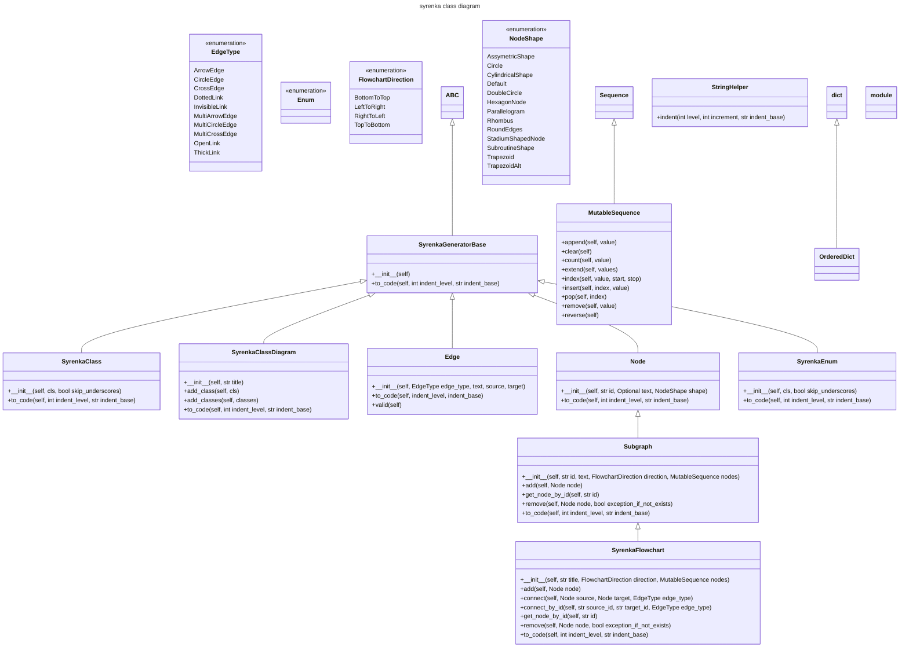

# syrenka
syrenka is mermaid markdown generator

## Description

The aim of this project is to provide easy to use classes for generating mermaid charts and diagrams.

## Installation

`pip install syrenka`

## Example

Here are current classes in syrenka module:

<!-- EX1_MERMAID_DIAGRAM_BEGIN -->

<!-- EX1_MERMAID_DIAGRAM_END -->

So how do we get it?
This is a code snippet that does it:

<!-- EX1_SYRENKA_CODE_BEGIN -->
```python
import syrenka
from syrenka.base import classes_in_module

class_diagram = syrenka.SyrenkaClassDiagram("syrenka class diagram")
# class_diagram.add_classes(generate_class_list_from_module(module_name="syrenka", starts_with="Syrenka"))
class_diagram.add_classes(classes_in_module(module_name="syrenka", nested=True))

for line in class_diagram.to_code():
    print(line)

```
<!-- EX1_SYRENKA_CODE_END -->

and the output:
<!-- EX1_MERMAID_DIAGRAM_RAW_BEGIN -->
```cmd
---
title: syrenka class diagram
---
classDiagram
    class SyrenkaClass{
        +\_\_init\_\_(self, cls, bool skip_underscores)
        +to_code(self, int indent_level, str indent_base)
    }
    SyrenkaGeneratorBase <|-- SyrenkaClass
    class SyrenkaClassDiagram{
        +\_\_init\_\_(self, str title)
        +add_class(self, cls)
        +add_classes(self, classes)
        +to_code(self, int indent_level, str indent_base)
    }
    SyrenkaGeneratorBase <|-- SyrenkaClassDiagram
    class SyrenkaFlowchart{
        +\_\_init\_\_(self, str title, FlowchartDirection direction, MutableSequence nodes)
        +add(self, Node node)
        +connect(self, Node source, Node target, EdgeType edge_type)
        +connect_by_id(self, str source_id, str target_id, EdgeType edge_type)
        +get_node_by_id(self, str id)
        +remove(self, Node node, bool exception_if_not_exists)
        +to_code(self, int indent_level, str indent_base)
    }
    Subgraph <|-- SyrenkaFlowchart
    class Edge{
        +\_\_init\_\_(self, EdgeType edge_type, text, source, target)
        +to_code(self, indent_level, indent_base)
        +valid(self)
    }
    SyrenkaGeneratorBase <|-- Edge
    class EdgeType{
        <<enumeration>>
        ArrowEdge
        CircleEdge
        CrossEdge
        DottedLink
        InvisibleLink
        MultiArrowEdge
        MultiCircleEdge
        MultiCrossEdge
        OpenLink
        ThickLink
    }
    class Enum{
        <<enumeration>>
    }
    class FlowchartDirection{
        <<enumeration>>
        BottomToTop
        LeftToRight
        RightToLeft
        TopToBottom
    }
    class MutableSequence{
        +append(self, value)
        +clear(self)
        +count(self, value)
        +extend(self, values)
        +index(self, value, start, stop)
        +insert(self, index, value)
        +pop(self, index)
        +remove(self, value)
        +reverse(self)
    }
    Sequence <|-- MutableSequence
    class Node{
        +\_\_init\_\_(self, str id, Optional text, NodeShape shape)
        +to_code(self, int indent_level, str indent_base)
    }
    SyrenkaGeneratorBase <|-- Node
    class NodeShape{
        <<enumeration>>
        AssymetricShape
        Circle
        CylindricalShape
        Default
        DoubleCircle
        HexagonNode
        Parallelogram
        Rhombus
        RoundEdges
        StadiumShapedNode
        SubroutineShape
        Trapezoid
        TrapezoidAlt
    }
    class OrderedDict{
    }
    dict <|-- OrderedDict
    class StringHelper{
        +indent(int level, int increment, str indent_base)
    }
    class Subgraph{
        +\_\_init\_\_(self, str id, text, FlowchartDirection direction, MutableSequence nodes)
        +add(self, Node node)
        +get_node_by_id(self, str id)
        +remove(self, Node node, bool exception_if_not_exists)
        +to_code(self, int indent_level, str indent_base)
    }
    Node <|-- Subgraph
    class SyrenkaGeneratorBase{
        +\_\_init\_\_(self)
        +to_code(self, int indent_level, str indent_base)
    }
    ABC <|-- SyrenkaGeneratorBase
    class SyrenkaEnum{
        +\_\_init\_\_(self, cls, bool skip_underscores)
        +to_code(self, int indent_level, str indent_base)
    }
    SyrenkaGeneratorBase <|-- SyrenkaEnum
    class ABC{
    }
    class module{
    }
```
<!-- EX1_MERMAID_DIAGRAM_RAW_END -->

ready to use mermaid markdown
