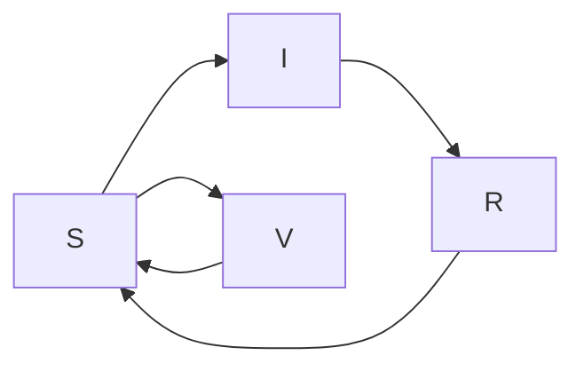

## *VaxSim*: Scenario Analysis tool for Vaccination Strategies to control Foot and Mouth Disease (FMD) transmission

---------------------------------------------------------------

[](https://github.com/dsih-artpark/vaxsim/blob/production/LICENSE)

*VaxSim* is a python package for simulating the spread of Foot and Mouth Disease (FMD) using a discrete compartmental model (SIRSV framework), along with control interventions such as periodic pulsed vaccination campaigns.

Installation & Usage
---------------------

### Installation from PyPI

```bash
pip install vaxsim
```

### Installation from GitHub

Using `uv`:
```bash
uv pip install git+https://github.com/dsih-artpark/vaxsim.git
```

Using conda environment:
```bash
conda create -n vaxsim_test python=3.11 -y
conda activate vaxsim_test
uv pip install git+https://github.com/dsih-artpark/vaxsim.git
```

For development:
```bash
git clone https://github.com/dsih-artpark/vaxsim.git
cd vaxsim
uv pip install -e .
```

### Model Description
The SIRSV model is an epidemiological framework designed to simulate the spread of infectious diseases, with a particular focus on Foot and Mouth Disease (FMD). This model expands upon the classical SIR (Susceptible-Infectious-Recovered) framework by introducing a fourth compartment for vaccinated individuals (V), thereby considering the effects of vaccination and immunity waning on disease transmission dynamics. Unlike traditional compartmental models, this approach allows for the re-vaccination of previously vaccinated individuals during each round, while systematically tracking the immunity decay time of each individual in vaccinated state.




### Model Parameters

| **Parameter** | **Description**                                                      | **Baseline** | **Min**  | **Max**  | **Unit**         | **Source**                        |
|---------------|----------------------------------------------------------------------|--------------|----------|----------|------------------|-----------------------------------|
| $\beta$       | Transmission rate                                                   | 0.12         | 1e-06    | -        | days<sup>-1</sup>| model fit                        |
| $\gamma$      | Recovery rate                                                       | 0.07         | 0.065    | 0.122    | days<sup>-1</sup>| [Yadav et al. (2019)](https://doi.org/10.3389/fvets.2019.00263) |
| $\mu$         | Effective vaccination rate                                          | 0.016        | 1e-06    | 1   | days<sup>-1</sup>| model fit                        |
| $\lambda_{\text{vax}}$ | Scale parameter for immunity decay in vaccinated individuals | 160          | 120      | 180      | days             | [Singh et al. (2019)](https://doi.org/10.3390/vaccines7030090)  |
| $k_{\text{vax}}$ | Shape parameter for immunity decay in vaccinated individuals      | 3            | 1        | 6        | -                | model fit                        |
| $\lambda_{\text{rec}}$ | Scale parameter for immunity decay in recovered individuals  | 1380         | 365      | 1800     | days             | [Pomeroy et al. (2015)](https://doi.org/10.1371/journal.pone.0136642) |
| $k_{\text{rec}}$ | Shape parameter for immunity decay in recovered individuals       | 3            | 1        | 6        | -                | model fit                        |
| $N$           | Total population                                                    | 1000000      | -        | -        | -                | -                                 |
| $S_0$         | Initial susceptible population                                       | 699998       | 400000   | 800000   | -                | model fit                        |
| $I_0$         | Initial infected population                                         | 2            | 1        | 10       | -                | model fit                        |
| $R_0$         | Initial recovered population                                         | 150000       | 100000   | 300000   | -                | model fit                        |
| $V_0$         | Initial vaccinated population                                        | 150000       | 100000   | 300000   | -                | model fit                        |
| days          | Simulation duration                                                 | 1100         | -        | -        | days             | -                                 |
| $\omega$      | Duration between successive pulses of vaccination                    | 335          | 1        | 1100     | days             | vaccination schedule datasets (GoK)     |
| $\tau$        | Duration of each vaccination pulse                                   | 30           | 1        | 1100     | days             | vaccination progress datasets (GoK)     |


### Running model scenarios

The package provides a command-line interface to run simulations:

```bash
# Run with specific scenario and model type
vaxsim --scenario <scenario_name> --model_type <model_type>

# Run baseline scenario with default settings
vaxsim --scenario baseline --model_type random

# Run parameter sweep
vaxsim --scenario parameter_sweep --model_type random
```

You can also use the Python API:

```python
from vaxsim.utils import load_params
from vaxsim.model import sirsv_model_with_weibull_random_vaccination

# Load parameters
params = load_params()['baseline']

# Run simulation
S, I, R, V = sirsv_model_with_weibull_random_vaccination(params, 'baseline')
```

List of provided scenarios are given below:

| Scenario Name | Remarks |
|----------------|---------|
| baseline       | 2021 FMD outbreak |
| scenario_1a    | Disease-free state with 100% annual vaccination starts from Day 1. |
| scenario_1b    | Disease-endemic state with 100% annual vaccination; Vacc starts from Day 1. |
| scenario_1c    | Baseline vaccination strategy in absence of infections. |
| scenario_2a    | Disease-free state with 100% bi-annual vaccination; Vacc starts from Day 1. |
| scenario_2b    | Disease-endemic state with 100% bi-annual vaccination; Vacc starts from Day 1. |
| scenario_2c    | Disease-free state with 50% bi-annual vaccination; Vacc starts from Day 1. |
| scenario_2d    | Disease-free state with 25% bi-annual vaccination; Vacc starts from Day 1. |
| scenario_3a    | Disease-free state with tri-annual vaccination and 66% coverage; Vacc starts from Day 1. |
| scenario_3b    | Disease-endemic state with tri-annual vaccination and 66% coverage; Vacc starts from Day 1. |
| scenario_3c    | Disease-free state with tri-annual vaccination and 33% coverage; Vacc starts from Day 1. |
| scenario_3d    | Disease-free state with tri-annual vaccination and 16.6% coverage; Vacc starts from Day 1. |
| scenario_4a    | Disease-free state with continuous vaccination and 2/365 daily coverage; Vacc starts from Day 1. |
| scenario_4b    | Disease-endemic state with continuous vaccination and 2/365 daily coverage; Vacc starts from Day 1. |
| scenario_4c    | Disease-free state with continuous vaccination and 1/365 daily coverage; Vacc starts from Day 1. |
| scenario_4d    | Disease-free state with continuous vaccination and 0.5/365 daily coverage; Vacc starts from Day 1. |
| parameter_sweep          | The parameter sweep evaluates combinations of vaccination rate and period, visualised in a heatmap where colour represents the output analysis function value for each pair. |

There are two model types, each based on distinct assumptions regarding the vaccination approach:

* **Random Vaccination Campaign:** In this model, previously vaccinated animals are selected randomly, and their time to immunity decay is updated according to a Weibull distribution.

* **Targeted Vaccination Campaign:** This model involves selecting previously vaccinated animals in ascending order of their time to immunity decay until the vaccination coverage for that round is achieved. Their time to immunity decay is also updated based on a Weibull distribution.

---

4. Parameter sweep

The parameter sweep performs a parameter sweep on a given SIRSV model by exploring combinations of two parameters and analysing the results using a specified function (e.g., AUC or equilibrium minimum protected fraction). The sweep can either be a diagonal sweep, where the two parameters are equal, or a full sweep where both parameters vary independently. 

To perform the parameter sweep:
```python3
python run_vaxsim.py --scenario parameter_sweep --model_type <model_type>
```

To customise the inputs and output function in parameter sweep, you can modify the invocation of the `run_parameter_sweep` function in `run_vaxsim.py` file.

Output functions are:
* AUC: Measures the area under the curve when the protected fraction of the population is below the Herd Immunity Threshold (HIT).
* Equilibrium minimum protected fraction: Measures the minimum fraction of the population that remains protected at equilibrium, which helps evaluate long-term disease control.

---

### Seeding Infection

To seed infections

### Output
The results of the simulations, including log files and visualisations, will be saved in the *`output`*  directory. Check the relevant subdirectories for logs and plots corresponding to each simulation run.

### Logging
Logs are created in the *`output/logs`* directory with filenames indicating the scenario and timestamp. The logging level is set to INFO by default.

### Contributing
Contributions to improve the model, enhance functionalities, or fix issues are welcome. Please fork the repository and submit a pull request with your changes.

### License
This project is licensed under the MIT License - see the [LICENSE](https://github.com/dsih-artpark/vaxsim/blob/production/LICENSE) file for details.
